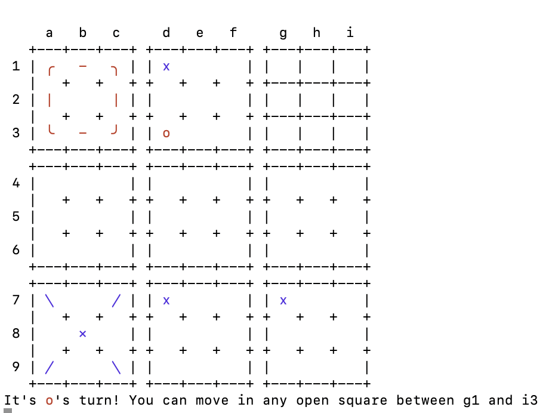
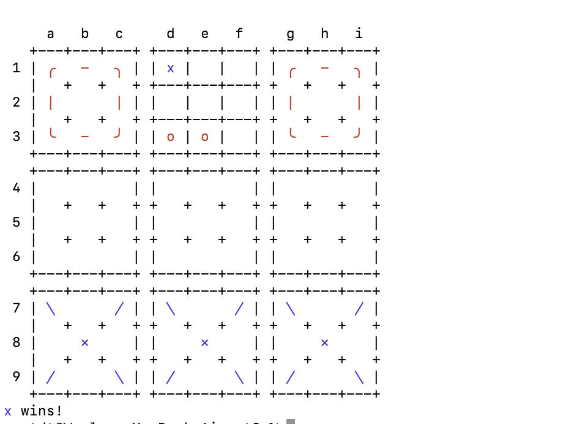
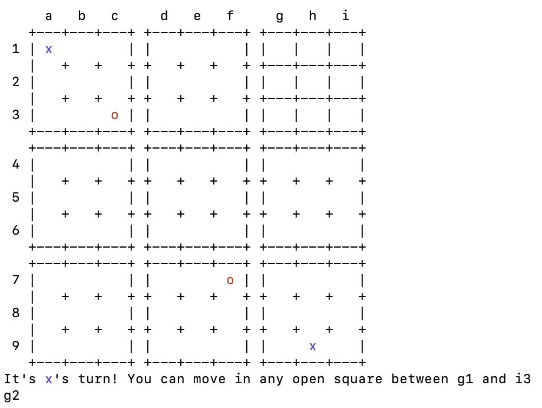
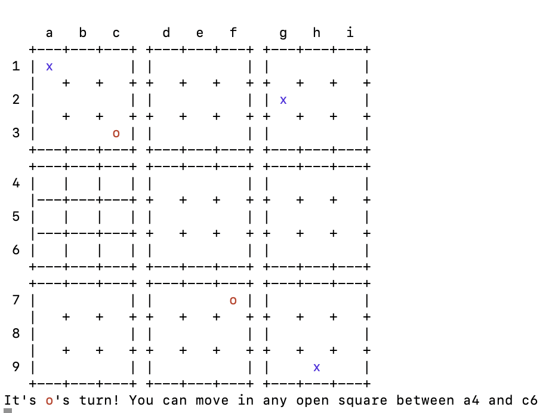

# ut3 - Ultimate Tic-Tac-Toe

## Overview
A simple [Ultimate Tic-Tac-Toe](https://en.wikipedia.org/wiki/Ultimate_tic-tac-toe) game that I programmed in [Rust](https://rust-lang.org).

It maybe doesn't have the cleanest code in the world but it functions correctly, so I'm satisfied with it.

## How to Play

Just like in regular tic-tac-toe, the two players (X and O) take turns. The game starts with either X or O playing wherever they want in any of the 81 empty spots. On each subsequent move, the players must play in the section of the larger board corresponding to the previous move's location within the smaller board it was played in.

If a move is played so that it wins a small board by the rules of normal tic-tac-toe, then the entire small board is marked as won by the player in the larger board. Once a small board is won by a player or it is filled completely, no more moves can be played in that board, and a player sent to that board may choose any other valid board to play in.

The game ends when either a player wins the larger board or there are no playable small boards remaining, in which case the game is a draw.

To make a move, simply enter the position you would like to play. For example, to play in the middle-left square of the top-right game, play `g2`.

## Bugs

There might be bugs in this. Please submit an issue if you find any bugs, I am happy to fix it. 

If you see weird characters on the screen, it is probably due to the ANSI colors not working correctly. I think these work on PowerShell and on most Linux/Unix terminals, but I am only on Mac, so if not, please let me know and I can create an alternate solution.

Currently there are no dependencies. If you have Rust installed, you can simply download the project and run `cargo run`.

## Future Features
- [ ] Draws (I somehow entirely forgot to code this)
- [ ] Minor TUI changes to make it more clear what moves are available
- [ ] Primitive AI so people can play alone
- [ ] Simple LAN multiplayer mode
